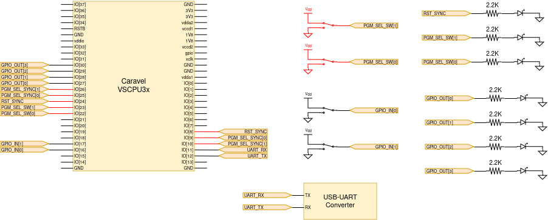

# Quickstart Guide
This document explains how to create an example test environment for VSCPU3x.
## Hardware Configuration
Follow the schematic to make proper connections for our example test environment.



**Note:** Make sure that you connect `*_SYNC` pins properly, they are essential for avoiding switching glitches.
## Firmware
Connect your computer to caravel board and run the terminal commands.
```bash
cd firmware/vscpu3x/vscpu3x_test

make clean flash
```
## VSCPU3x Software
To run tests on VerySimpleCPU, after flashing the firmware, you should first program the cores. To physically enable this, you need to switch `PGM_SEL_SW` bits accordingly.

| PGM_SEL_SW | Explanation |
|------------|------------|
| 2'b00      | Run all cores|
| 2'b01      | Program or read codemaker core memory|
| 2'b10      | Program or read control tower core memory|
| 2'b11      | Program or read agent 0 core memory|

**Important Note:** Please make sure that you program the chips in 2,3,1 or 1,3,2 order to avoid running the cores before all cores are programmed (remember 0 means run all cores). 

To run a test on VSCPU cores, please run the following terminal commands.

```bash
cd vscpu3x_apps/utils

# Usage: 
#   test_name: Test name, e.g. bubble_sort
#   uart_device: Path to UART device, e.g. /dev/ttyUSB0
#   -nomemclear: Memory needs clearing at the first time and when writing a new program. 
#                In other cases you can use this to save time.
python3 run_test.py <test_name> <uart_device> <-nomemclear>
```
The file naming convention in tests are given below.
- test_name: Name of the folder and prefix of the files. e.g. `bubble_sort`
- processor_name: Can be `cm`, `ct`, `a0` for codemaker, control tower, agent 0 respectively.

With these naming, explanation of the files that you might find in the test folder is like below.
- `<test_name>_<processor_name>.asm`: VSCPU assembly file.
- `<test_name>_<processor_name>.mem`: VSCPU memory file for writing into core memories.
- `<test_name>_<processor_name>_chk.mem`: VSCPU check file for checking memory after the program has run.

If you have asm files to convert into mem files, please run asmtomem.py as instructed below

```bash
cd vscpu3x_apps/utils

# Usage: 
#   asm_file: Assembly file name, e.g. ../knightrider/knightrider_cm.asm.
#             Make sure you have written file path properly, and it is a .asm file, otherwise it will complain.
python3 asmtomem.py <asm_file>
```