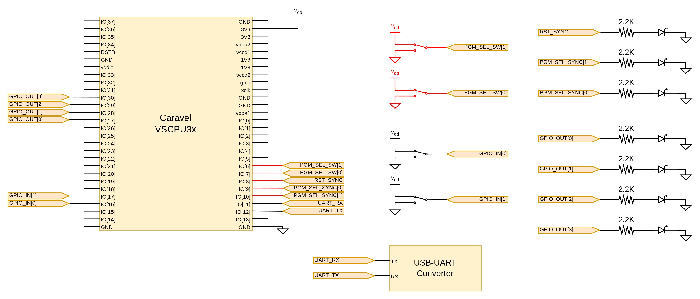

# Quickstart Guide
This document explains how to create an example test environment for VSCPU3x.
## Hardware Configuration
Follow the schematic to make proper connections for our example test environment.



The management firmware now drives reset and program selection through GPIOs
configured as `GPIO_MODE_MGMT_STD_BIDIRECTIONAL`. The user logic reads these same
pads internally (`RST_SYNC` on GPIO 8 and `PGM_SEL_SYNC[1:0]` on GPIOs 10:9), so
the external jumper loopbacks used in the previous setup are no longer needed.

**Note:** The exposed `*_SYNC` connections in the schematic are **optional** and
provided for visibility/debugging. They can be left externally unconnected;
no external drive is required. Keep the management firmware workaround described
under [Program-selection inputs](#program-selection-inputs).
## Firmware
Connect your computer to caravel board and run the terminal commands.
```bash
cd firmware/vscpu3x/vscpu3x_test

make clean flash
```
## VSCPU3x Software
To run tests on VerySimpleCPU, after flashing the firmware, you should first program the cores. To physically enable this, you need to switch `PGM_SEL_SW` bits accordingly.

| PGM_SEL_SW | Explanation |
|------------|------------|
| 2'b00      | Run all cores|
| 2'b01      | Program or read codemaker core memory|
| 2'b10      | Program or read control tower core memory|
| 2'b11      | Program or read agent 0 core memory|

**Important Note:** Please make sure that you program the chips in 2,3,1 or 1,3,2 order to avoid running the cores before all cores are programmed (remember 0 means run all cores). 

To run a test on VSCPU cores, please run the following terminal commands.

```bash
cd vscpu3x_apps/utils

# Usage: 
#   test_name: Test name, e.g. bubble_sort
#   uart_device: Path to UART device, e.g. /dev/ttyUSB0
#   -nomemclear: Memory needs clearing at the first time and when writing a new program. 
#                In other cases you can use this to save time.
#   -uart: Open the codemaker UART console in operating mode (Linux/macOS terminal).
python3 run_test.py <test_name> <uart_device> [-nomemclear] [-uart]
```

Both flags are optional and can be used together.

With `-uart`, after programming, switch to operating mode and press Enter at the prompt to open
the console. It uses the same UART device and baud rate (57600 by default).
Received characters appear immediately. Type text and press Enter to transmit it
followed by a NUL byte (`\0`); an empty line sends just the NUL byte. The console
does not send carriage returns or newlines. Type `~.` on a line by
itself and press Enter to close the console, or press Ctrl+C. The escape command
is not transmitted. Return to programming mode and follow the prompts for any
memory checks. Without `-uart`, the existing manual run/check flow is unchanged.

The following tests are available in `vscpu3x_apps`. All currently target the
codemaker core (`cm`); use the folder name as `test_name`.

| Test | Description | How to check the result |
|------|-------------|-------------------------|
| [`bubble_sort`](../vscpu3x_apps/bubble_sort) | Sorts ten numbers in descending order using bubble sort. | The runner compares memory against `bubble_sort_cm_chk.mem` after you return to programming mode. |
| [`knightrider`](../vscpu3x_apps/knightrider) | Continuously shifts a GPIO output pattern back and forth to produce a Knight Rider LED effect. | Observe the connected LEDs. |
| [`hello_world`](../vscpu3x_apps/hello_world) | Sends `Hello World!` once over UART, then halts. | Use `-uart` and observe the greeting. |
| [`hello`](../vscpu3x_apps/hello) | Receives a NUL-terminated name, keeps up to 16 characters, and replies once with `Hello <name>!`, then halts. | Use `-uart`, type a name, and press Enter to send it with the NUL terminator. |

Only `bubble_sort` includes a memory-check file. For the other examples, verify
the LED or UART behavior; the runner's `Test SUCCEEDED` message does not validate
that output.

The file naming convention in tests are given below.
- test_name: Name of the folder and prefix of the files. e.g. `bubble_sort`
- processor_name: Can be `cm`, `ct`, `a0` for codemaker, control tower, agent 0 respectively.

With these naming, explanation of the files that you might find in the test folder is like below.
- `<test_name>_<processor_name>.asm`: VSCPU assembly file.
- `<test_name>_<processor_name>.mem`: VSCPU memory file for writing into core memories.
- `<test_name>_<processor_name>_chk.mem`: VSCPU check file for checking memory after the program has run.

Memory files use hexadecimal words and hexadecimal `@` address markers, as in
Verilog memory format: `@12D` selects word address 301. Assembly addresses remain
decimal; `asmtomem.py` converts them when generating memory files.

If you have asm files to convert into mem files, please run asmtomem.py as instructed below

```bash
cd vscpu3x_apps/utils

# Usage: 
#   asm_file: Assembly file name, e.g. ../knightrider/knightrider_cm.asm.
#             Make sure you have written file path properly, and it is a .asm file, otherwise it will complain.
python3 asmtomem.py <asm_file>
```

## Known Limitations

### Program-selection inputs

The VSCPU3x `program_sel` inputs do not have an internal hardware synchronizer.
Switch transitions and glitches can therefore cause unintended program/run mode
changes.

**Workaround — strongly recommended:** Use the management-side program-selection
and reset-handling code in
[`vscpu3x_test.c`](../firmware/vscpu3x/vscpu3x_test/vscpu3x_test.c), or preserve
equivalent handling in custom firmware. It samples the program-selection switches,
delays updates, and pulses reset when entering or leaving programming mode. The
bidirectional GPIO configuration delivers the resulting signals to the user logic
without external jumper loopbacks. This firmware workaround improves switching
reliability, but does not add a hardware synchronizer inside VSCPU3x. The external
`*_SYNC` connections remain optional even when using this workaround.

### Internal clock-generator frequency range

Caravel calls its internal clock generator a digital PLL; the closed-loop mode
is technically a **frequency-locked loop (FLL)**, as noted in the
[Caravel RTL](https://github.com/efabless/caravel/blob/main/verilog/rtl/digital_pll.v).
In **digitally controlled oscillator (DCO)** mode, its ring oscillator runs freely
with a manually configured trim value.

On our tested hardware, the oscillator frequency saturates at approximately
**96 MHz** in both FLL and DCO modes. We have observed operation in the
**50–80 MHz** range, but have **not yet measured the lower frequency limit**.

Reference ranges vary: the
[Caravel documentation](https://caravel-harness.readthedocs.io/en/latest/housekeeping-spi.html#housekeeping-spi-registers)
specifies 90–214 MHz for the PLL feedback target, while other reported ranges
include 50–120 MHz. Do not assume these ranges are achievable on this board;
verify the actual frequency when changing clock settings.

### Internal GPIO pulls

The internal pull-up/pull-down configurations may not behave as expected. We
have not yet performed detailed tests to characterize this behavior.

**Workaround:** For reliable input biasing, configure the input as `NOPULL`
(`GPIO_MODE_MGMT_STD_INPUT_NOPULL` or `GPIO_MODE_USER_STD_INPUT_NOPULL`, as
appropriate) and use an external **5–10 kΩ** pull-up or pull-down resistor to
establish the required default logic level.
